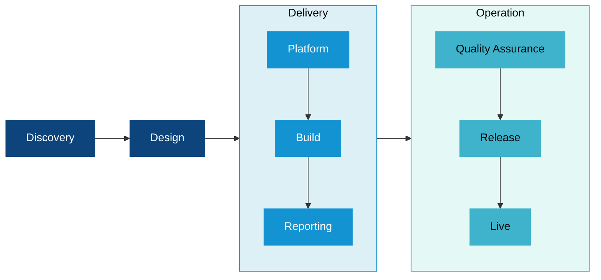

# Data Platform Delivery Framework

The Data Platform Delivery Framework organises project delivery across three stages: Definition, Delivery, and Operation. Each stage represents a distinct section of the project lifecycle, and each contains three phases that must be completed in sequence before the next stage begins.

Definition establishes a clear understanding of the project before any build work begins. It confirms what the solution needs to deliver and why, and produces a detailed Design that will govern the build.

Delivery builds the solution in line with the agreed design. It provisions and configures the platform, develops the data architecture and models, and produces the reports and dashboards that will be used by the business. 

Operation takes the completed solution into production. It covers testing and quality assurance, the release to end users, and the ongoing support and improvement of the live solution. 

The framework is designed to be cyclic. As the live solution matures, new use cases and enhancements will be identified, and the engagement returns to the Pre-Discovery phase to scope and assess the next phase of work before any further delivery begins.

